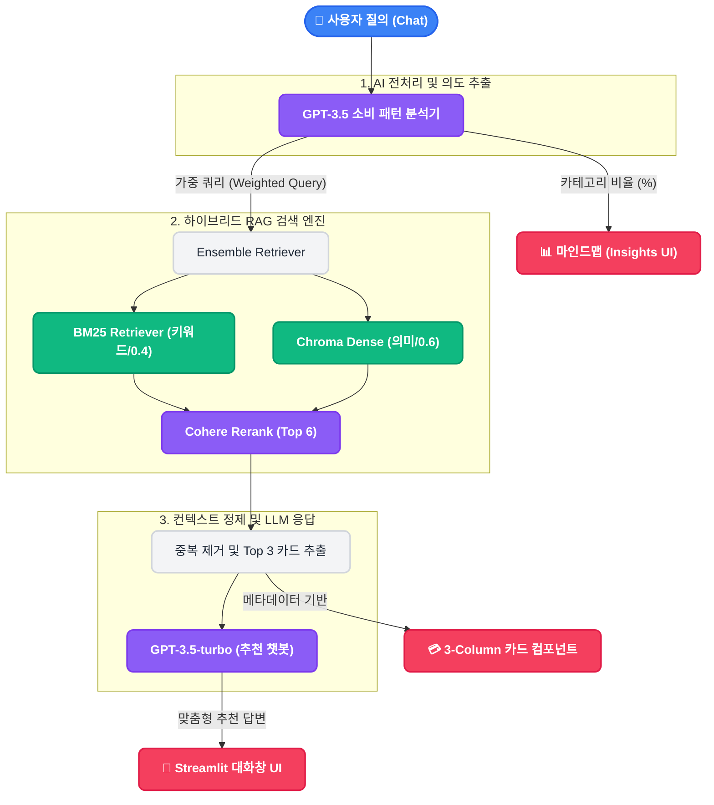

# The Finance Curator (Card Concierge)

**The Finance Curator**는 대화형 AI 기술(LLM)과 검색 증강 생성(RAG) 파이프라인을 결합하여, 사용자의 소비 패턴을 딥 분석하고 최적의 신용카드를 추천해주는 지능형 챗봇 서비스입니다.

---

## 🌟 주요 기능 및 특징

- **소비 패턴 기반 맞춤형 카드 추천**
  - 사용자가 채팅에 입력한 자유로운 문장을 분석하여 지출 비중이 높은 핵심 분야를 % 단위로 추출하고 맞춤형 혜택 텍스트(`search_profile`)를 재생성합니다.
- **고도화된 RAG(Hybrid Retrieval + Reranking) 파이프라인**
  - **BM25 Retriever (키워드 검색)**: "배달", "대중교통" 등 사용자가 입력한 구체적인 키워드 정확도 보장
  - **Chroma Dense Retriever (의미 기반 유사도 검색)**: 문서의 맥락 기반 검색 
  - 위 2가지를 **Ensemble Retriever(가중치 4:6)**로 결합한 후, **Cohere Rerank(v3.5)**를 거쳐 상위 카드를 가장 정확하게 선별합니다.
- **동적 마인드맵 인터랙션 뷰 (`Insights`)**
  - `streamlit-agraph`를 활용해 대화를 바탕으로 도출된 소비 성향을 마인드맵 그래프로 시각화합니다.
  - 마인드맵의 혜택 노드를 클릭하면 해당 카테고리에 특화된 카드 목록을 카드 슬라이더 인터페이스로 탐색할 수 있습니다.
- **안정적인 DB 구축 처리**
  - 카드 데이터를 ChromaDB로 저장할 때 발생할 수 있는 OpenAI Rate Limit(속도 제한) 오류 및 SQLite 쓰기 잠금 문제를 방지하기 위해 배치(Batch) 처리 및 지수 백오프(Exponential Backoff) 재시도 알고리즘을 도입했습니다.

---

## 🏗 시스템 아키텍처



---

## 🚀 시작하기 (Setup Guide)

이 프로젝트를 로컬 환경에서 실행하기 위한 설정 방법입니다.

### 1. 환경 변수 설정
프로젝트 최상단 루트 디렉토리에 `.env` 파일을 생성하고 다음 API 키를 설정합니다.

```env
OPENAI_API_KEY="sk-..."    # 필수: OpenAI 모델 및 임베딩용
COHERE_API_KEY="..."       # 필수: Cohere Reranker 전용 키
```

### 2. 가상환경 생성 및 필수 패키지 설치
다른 패키지와의 충돌을 방지하기 위해 독립된 파이썬 가상환경을 생성하고, 패키지들을 설치합니다.

```bash
# 가상환경 생성 (macOS/Linux)
python3 -m venv venv
source venv/bin/activate

# 가상환경 생성 (Windows)
python -m venv venv
venv\Scripts\activate

# 필수 패키지 설치
pip install -r requirements.txt
```

### 3. Vector DB 생성 (최초 1회 실행)
채팅을 실행하기 전, 카드 데이터 원본(`data/cards.json` 등)을 청킹 및 임베딩하여 로컬 벡터 저장소(`VectorStores_Card`)를 구축해야 합니다.

```bash
python vector_db.py
```
> ※ 콘솔에 "성공. '{my_directory}' 폴더에 카드 데이터 벡터 DB가 생성되었습니다." 메시지가 뜨면 정상 처리된 것입니다.

### 4. 어플리케이션(Streamlit) 실행
DB 구축이 끝나면 Streamlit을 통해 챗봇 UI를 띄워 서비스를 이용할 수 있습니다.

```bash
streamlit run app.py
```

---

## 🛠 주요 사용 기술 스택
- **Language**: Python
- **Frontend / UI**: Streamlit, streamlit-agraph
- **LLM / Orchestration**: LangChain, OpenAI (`gpt-3.5-turbo-16k`, `text-embedding-3-small`)
- **Reranker**: Cohere (`rerank-v3.5`)
- **Vector DB**: ChromaDB

### 시작하기 (Setup Guide)
이 프로젝트를 로컬 환경에서 실행하기 위한 설정 방법입니다. 
macOS 터미널 기준으로 작성되었습니다.

#### 1. 저장소 복제 (Clone)
먼저 GitHub에 있는 코드를 내 컴퓨터로 가져옵니다.

```Bash
git clone <레포지토리-주소>
cd <폴더-이름>
```

#### 2. 가상환경 생성 (Create Virtual Environment)
다른 프로젝트와의 패키지 충돌을 방지하기 위해 독립된 가상환경을 만듭니다.

```Bash
python3 -m venv venv
```

#### 3. 가상환경 활성화 (Activate)
생성한 가상환경을 현재 터미널 세션에 적용합니다. (활성화되면 터미널 앞에 (venv) 표시가 나타납니다.)

```Bash
source venv/bin/activate
```
#### 4. 필수 패키지 설치 (Install Dependencies)
requirements.txt에 기록된 필요한 라이브러리들을 한꺼번에 설치합니다.

```Bash
pip install -r requirements.txt
```

가상환경 종료: 작업을 마친 후 가상환경을 나가려면 deactivate를 입력하세요.

패키지 업데이트: requirements.txt 내용이 변경되었다면 다시 pip install -r requirements.txt를 실행하여 업데이트하세요.
