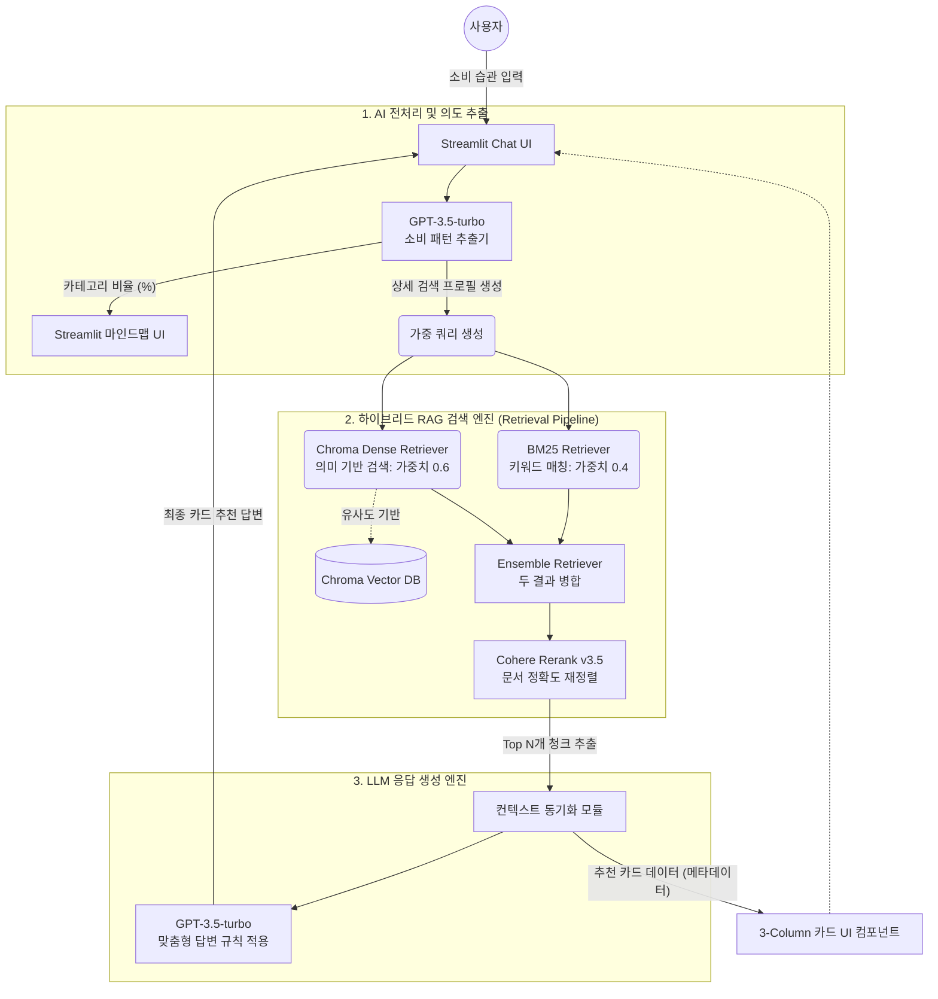
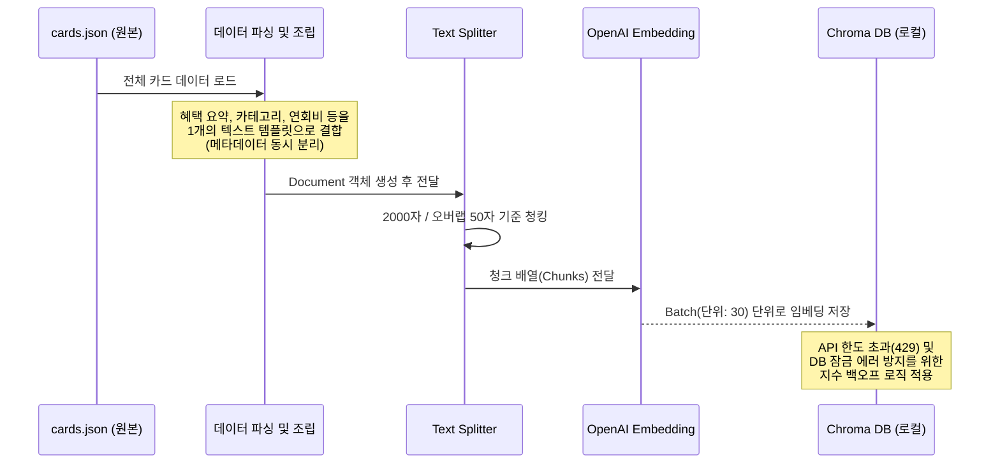

# 🏛 The Finance Curator (Card Concierge) 아키텍처 및 파일 구조 가이드

이 문서는 프로젝트가 어떻게 구성되어 있고 데이터가 어떤 흐름으로 처리되는지 직관적으로 이해할 수 있도록 돕는 시각화 가이드입니다.

---

## 1. 📂 프로젝트 파일 구조 (Directory Structure)

프로젝트의 핵심 디렉토리 및 파일은 다음과 같이 구성되어 있습니다.

```text
card_chat/
│
├── 📄 app.py                  # [메인 실행 파일] Streamlit 앱 실행 및 UI/RAG 챗봇 로직 관장
├── 📄 vector_db.py            # [데이터 엔지니어링] 카드 JSON 파싱 및 Chroma 벡터 DB 구축 스크립트
├── 📄 requirements.txt        # 파이썬 패키지 의존성 목록
│
├── 📁 data/                   # [원천 데이터 저장소]
│   ├── cards.json             # 신용카드 혜택, 연회비, 실적 조건 등이 담긴 원본 데이터
│   └── categories_rows.json   # 카테고리 매핑 등 추가 데이터
│
├── 📁 VectorStores_Card/      # [Chroma Vector DB] vector_db.py 실행 시 생성되는 로컬 벡터 저장소
│
└── 📄 README.md               # 셋업 가이드 및 프로젝트 요약 문서
```

---

## 2. 🧩 시스템 아키텍처 다이어그램 (System Architecture)

전반적인 앱의 동작 흐름은 크게 **[UI 및 질의 입력] -> [검색 파이프라인] -> [AI 응답 생성] -> [UI 렌더링]** 의 4단계로 구성됩니다.



---

## 3. 🔍 데이터 파이프라인 (Vector DB 구축 과정)

앱 실행 전 단 1회 수행되는 `vector_db.py` 의 흐름입니다. 이 과정이 있어야 RAG 챗봇이 작동합니다.



---

## 4. 💡 아키텍처 주요 특징

> [!TIP]
> **왜 하이브리드(Ensemble) 방식을 사용했나요?**
> 단순 벡터 유사도(ChromaDB)만 사용하면 "배달", "통신비" 같은 명확한 키워드를 놓칠 때가 있습니다. 이를 극복하기 위해 키워드 매칭에 강한 BM25와 결합한 후, Cohere의 고급 재정렬(Reranking) 기술을 통해 상위 결과의 신뢰도를 대폭 상승시켰습니다.

> [!NOTE]
> **컨텍스트 동기화 모듈의 역할**
> 이전 방식에서는 추천 답변을 만드는 LLM이 읽은 카드 정보와, 화면 하단 UI에 그려지는 카드 목록이 다르게 나타나는 버그가 발생할 수 있었습니다. 이 아키텍처에서는 검색된 결과를 UI와 LLM에 동시에 배분하여 **추천 내용과 화면 카드가 정확히 일치(동기화)**하도록 설계되어 있습니다.
